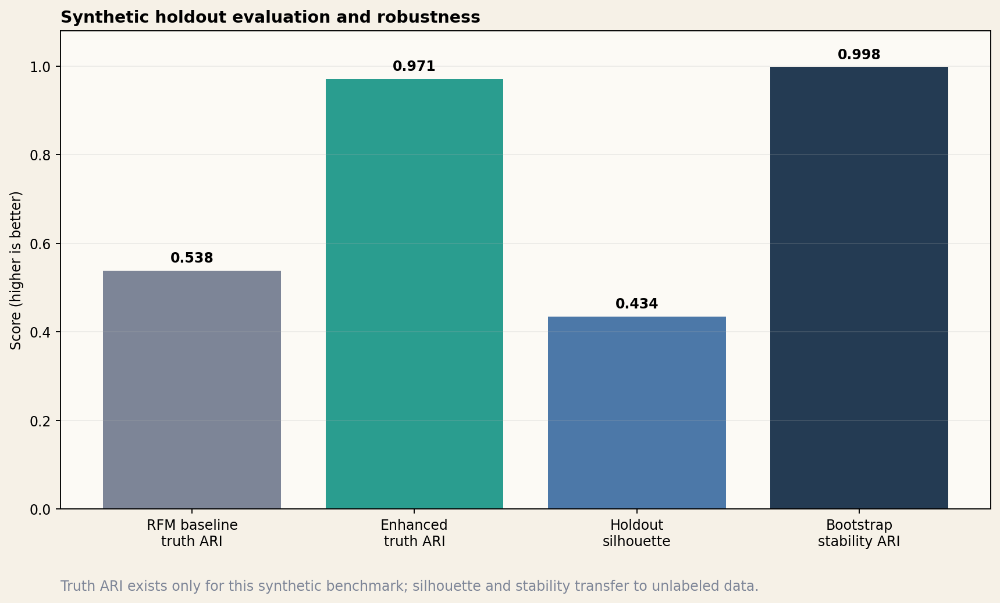
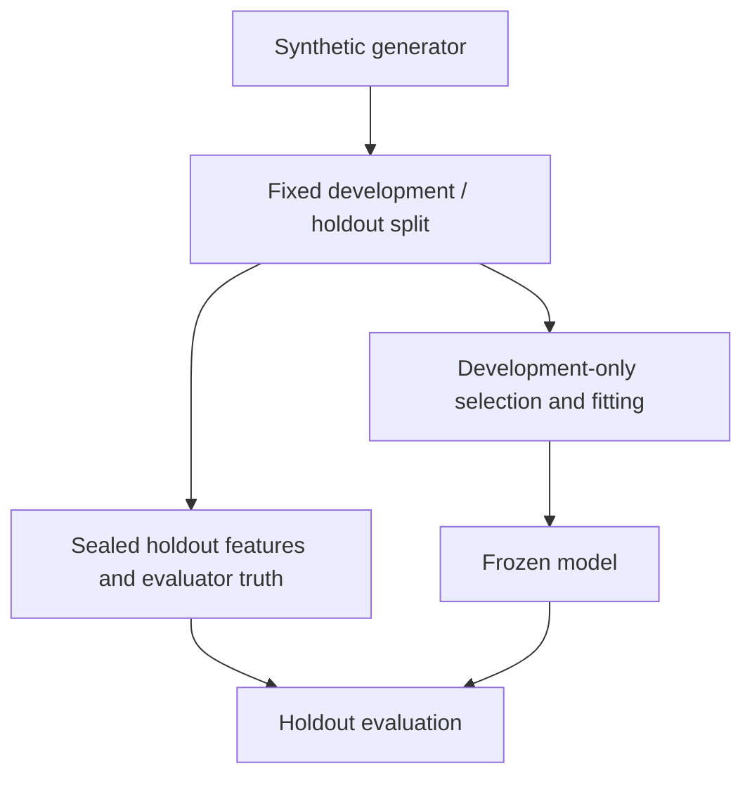
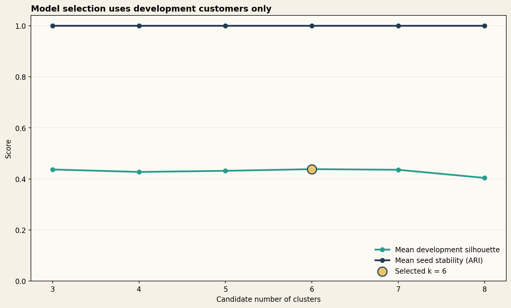
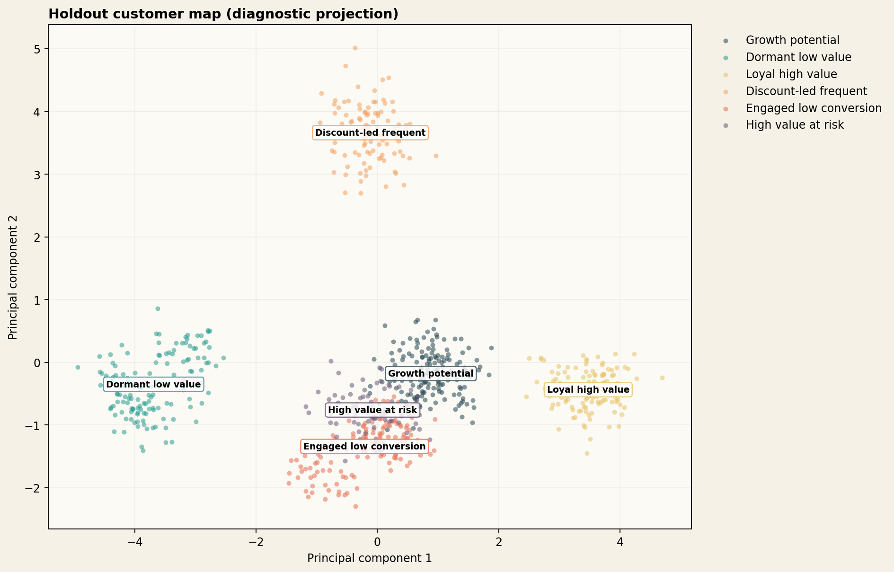
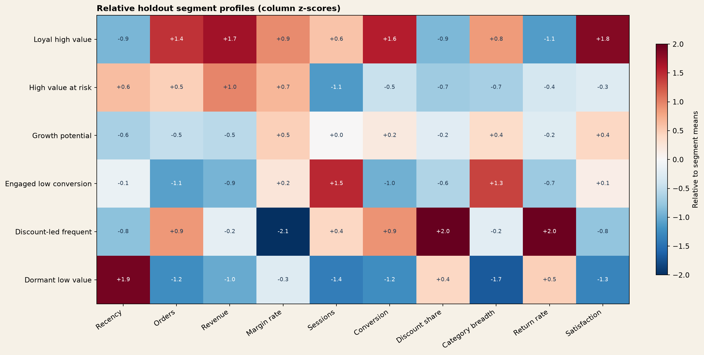
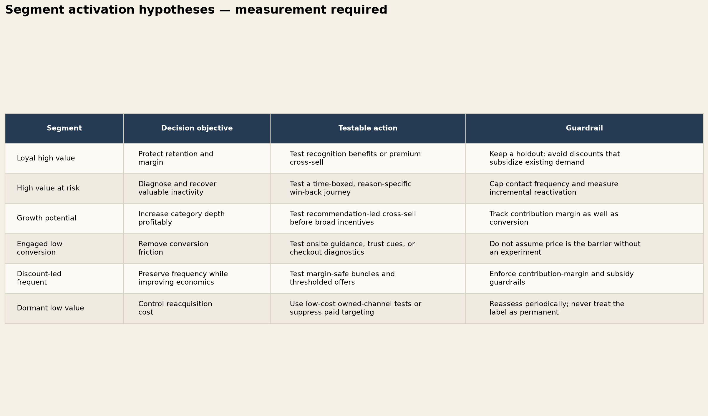

# Customer Segmentation Decision System

[](https://github.com/parisaMSTFV/customer-segmentation-decision-system/actions/workflows/ci.yml)
[](https://www.python.org/)
[](docs/INPUT_SCHEMA.md)

Turn behavioral and value signals into a governed six-segment decision layer with frozen scoring, drift monitoring, explicit action hypotheses, and measurement guardrails.

## Executive summary

Customer targeting becomes difficult when value, activity, price sensitivity, engagement, and experience signals are reviewed separately. This project generates a fully synthetic customer benchmark, evaluates K-means candidates on 2,250 development customers, freezes the governed six-segment pipeline, and evaluates it on 750 untouched holdout customers. The ten-feature model recovers the planted synthetic structure with an adjusted Rand index (ARI) of **0.971**, compared with **0.538** for a fixed-`k` RFM baseline and **0.575** for an independently selected RFM baseline. Holdout silhouette is **0.443**, and mean bootstrap stability is **0.997**.

The output is a six-segment decision layer with an action hypothesis and a measurement guardrail for every segment. These results verify the public pipeline against known synthetic structure; they do **not** demonstrate campaign lift, ROI improvement, or production accuracy.



## Use your customer features

```bash
uv sync --locked --extra dev
export CUSTOMER_SEGMENTATION_ID_SALT="$(python -c 'import secrets; print(secrets.token_hex(32))')"

customer-segmentation fit \
  --input /path/to/training_snapshot.csv \
  --model-dir artifacts/customer-segmentation/model \
  --output-dir artifacts/customer-segmentation/fit

customer-segmentation score \
  --input /path/to/current_snapshot.csv \
  --model-dir artifacts/customer-segmentation/model \
  --output-dir artifacts/customer-segmentation/score \
  --previous-assignments artifacts/customer-segmentation/fit/customer_segments.csv
```

`fit` validates a dated feature snapshot, checks absolute and relative quality floors, and saves a checksum-verified definition. `score` reuses that frozen definition, reports feature PSI, segment-share PSI, centroid shift, and optional customer migration. External assignment IDs are HMAC-pseudonymized by default. Failed monitoring gates mark assignments `review_required`; campaign impact remains `Not evaluated`. See the [external input contract](docs/INPUT_SCHEMA.md).

## Business problem

Aggregate customer metrics can hide materially different decision contexts: valuable customers becoming inactive, frequent customers whose economics depend on discounts, or highly engaged customers who rarely convert. A useful segmentation system needs to separate these patterns, remain reproducible, and translate profiles into experiments that a marketing or customer team can evaluate.

This repository addresses three portfolio-relevant questions:

1. Can multi-signal behavioral segmentation recover structure that an RFM-only baseline misses?
2. Is the result stable across seeds, samples, and an untouched holdout?
3. Can each discovered segment be connected to an explicit action hypothesis and guardrail without turning correlation into a causal claim?

## Analytical questions

- Which number of clusters balances separation, resample stability, usable segment size, and the governed business taxonomy?
- How much synthetic structure does the enhanced feature set recover relative to RFM alone?
- Are the selected clusters stable when the development population is resampled?
- What behaviors make each cluster distinct on the holdout set?
- Which decision could each profile inform, and what must be measured before activation?

## Dataset and generation method

All 3,000 customers are synthetic. The generator creates six overlapping behavioral archetypes and then samples noisy observations for ten non-sensitive features:

- recency, order frequency, and revenue;
- margin rate;
- sessions and conversion rate;
- discount-order share and category breadth;
- return rate and satisfaction score.

The planted archetype is stored separately in `data/synthetic/evaluator_truth.csv`. It is never present in the model matrix and is used only after fitting to evaluate recovery on the holdout. `data/synthetic/customer_features.csv` contains the observations available to the model.

No real customer, order, company, schema, endpoint, or internal metric is included. Demographics and protected characteristics are deliberately excluded because they are unnecessary for this public decision example and would introduce additional fairness and governance risk.

See [data provenance](docs/DATA_PROVENANCE.md) and the [data README](data/README.md).

## Evaluation design

The split and evaluator boundary are explicit:



- **Development:** 2,250 customers for candidate selection, scaling, centroid fitting, and bootstrap analysis.
- **Holdout:** 750 customers used only after the enhanced and baseline models are frozen.
- **Model candidates:** K-means with `k` from 3 through 8 across five bootstrap resamples.
- **Eligibility guardrails:** every development cluster must contain at least 5% of customers, mean silhouette must be at least `0.20`, and minimum resample ARI must be at least `0.70`.
- **Selection score:** 70% mean silhouette and 30% resample-stability ARI.
- **Governed choice:** six segments are retained only when eligible and within the configured practical tolerance of the best candidate.
- **Baselines:** RFM is reported once at the governed `k` and once at the `k` selected by its own candidate evidence.

The candidate table exposes the score spread, silhouette standard deviation, minimum resample ARI, and the business tolerance used to retain `k=6`. Six segments are a governed decision within that tolerance, not a universal statistical truth.



## Methodology

1. Generate deterministic synthetic observations and a separate evaluator-truth table.
2. Validate identifiers, required fields, missingness, rate bounds, and absence of truth leakage.
3. Split customers once with a controlled seed.
4. Apply `log1p` to skewed count and monetary features, clip development extremes, then standardize using development-only parameters.
5. Evaluate candidate cluster counts using separation, bootstrap-resample stability, minimum-size constraints, and an explicit business tolerance.
6. Fit the enhanced model plus fixed- and independently selected-`k` RFM baselines on development customers.
7. Predict untouched holdout customers and compute intrinsic and synthetic-evaluator metrics.
8. Repeat fitting on eight bootstrap samples and compare predictions on a common development frame.
9. Freeze descriptive names from development profiles, then apply those names to untouched holdout clusters and create a decision playbook.
10. Generate CSV, JSON, HTML, and PNG artifacts from one command.

## Baseline

The RFM-only baselines use the same preprocessing and K-means implementation as the enhanced model, but see only recency, orders, and revenue. The fixed-`k` comparison isolates feature coverage; the self-selected comparison allows RFM to choose its own cluster count.

The fixed-`k` RFM baseline reaches holdout synthetic-truth ARI **0.538** and the self-selected RFM baseline reaches **0.575**. The enhanced ten-feature model reaches **0.971**.

## Evaluation metrics

| Metric | Executed result | Interpretation |
|---|---:|---|
| Enhanced holdout synthetic-truth ARI | 0.971 | Recovery of planted structure; synthetic evaluator only |
| RFM fixed-`k` holdout synthetic-truth ARI | 0.538 | Feature-coverage comparison at the governed cluster count |
| RFM self-selected holdout synthetic-truth ARI | 0.575 | RFM chooses its own cluster count from development evidence |
| Shuffled-label null ARI | -0.0003 | Chance-like reference |
| Holdout silhouette | 0.443 | Separation in the enhanced transformed feature space |
| Holdout Davies–Bouldin | 0.893 | Compactness/separation; lower is better |
| Holdout Calinski–Harabasz | 701.5 | Between/within-cluster dispersion ratio |
| Mean bootstrap pairwise ARI | 0.997 | Agreement across eight resampled fits |
| Minimum bootstrap pairwise ARI | 0.994 | Worst observed resample agreement |
| Smallest holdout segment | 11.7% | No tiny holdout segment in this run |

The source of record is [`reports/metrics.json`](reports/metrics.json). ARI against planted truth cannot be calculated on ordinary unlabeled customer data; silhouette, size, stability, drift, and expert review remain available.

## Key results

- Six governed clusters were retained without using evaluator truth and only after candidate eligibility checks.
- The enhanced feature set recovered substantially more planted structure than RFM alone.
- All six development profiles received unique, behavior-based names before holdout evaluation.
- Every segment has one testable action, one explicit guardrail, and impact status `Not evaluated`.
- The complete artifact fingerprint is `08c2b456dd75a419`; a clean smoke run reproduces it.

These results describe code executed with seed `42`. They are not estimates of expected results on private or production data.

## Visual results

### Holdout segment map

The PCA projection is a diagnostic view of the frozen model's holdout assignments. PCA is not used for clustering.



### Relative profiles

Columns are standardized across the six holdout segment means. Red indicates a higher relative value and blue a lower one; for features such as recency or return rate, “higher” is not necessarily desirable.



### Decision playbook

The playbook makes the distinction between a descriptive profile and a causal treatment decision visible.



An executable standalone output is available as the [segment decision brief](reports/segment_decision_brief.html).

## Business interpretation

| Segment | Holdout share | Profile summary | Decision hypothesis |
|---|---:|---|---|
| Loyal high value | 15.9% | Recent, high frequency, high value, strong margin and satisfaction | Test recognition or premium cross-sell while protecting margin |
| High value at risk | 11.7% | Historically valuable, less recent, and currently less engaged | Test a reason-specific, contact-capped win-back journey |
| Growth potential | 21.3% | Moderate activity and value with broader-category potential | Test recommendation-led cross-sell before broad incentives |
| Engaged low conversion | 18.8% | High sessions and category breadth but low orders and conversion | Test friction-reduction or trust interventions before assuming price sensitivity |
| Discount-led frequent | 14.0% | Frequent ordering with high discount and return rates but low margin | Test margin-safe bundles with subsidy controls |
| Dormant low value | 18.3% | Long recency, low activity, low value, and weak satisfaction | Use low-cost tests or suppress expensive reacquisition |

These are activation hypotheses. Incremental effects require randomized experiments or a defensible matched design. The full wording and measurement requirements are in the [decision playbook](docs/decision_playbook.md).

## Repository structure

```text
customer-segmentation-decision-system/
├── configs/analysis.json
├── data/
│   ├── synthetic/
│   └── processed/
├── docs/INPUT_SCHEMA.md
├── reports/
│   ├── figures/
│   ├── metrics.json
│   ├── model_selection.csv
│   ├── rfm_model_selection.csv
│   ├── segment_profiles.csv
│   ├── decision_playbook.csv
│   └── segment_decision_brief.html
├── scripts/check_sensitive.py
├── src/customer_segmentation/
│   ├── artifact.py
│   ├── monitoring.py
│   └── resources/analysis.json
├── tests/
├── .github/workflows/ci.yml
├── Makefile
├── pyproject.toml
└── uv.lock
```

The reusable pipeline lives in `src`; no notebook is required to reproduce the result.

## How to run

Python 3.11 or 3.12 is recommended. `uv.lock` pins the resolved development and CI environment.

```bash
uv sync --locked --extra dev
make reproduce
```

The equivalent direct command is:

```bash
MPLCONFIGDIR=.matplotlib uv run --locked customer-segmentation reproduce
```

To execute the full pipeline without modifying repository artifacts:

```bash
make smoke
```

## Tests and quality checks

```bash
make check
```

The current suite contains **59 passing tests** with **94.32% coverage** and a minimum 90% gate, covering:

- deterministic generation and observation/truth separation;
- snapshot dates, signed margin, count types, Unicode and leading-zero identifiers, bounds, and unexpected-column rejection;
- feature transformations without input mutation;
- label-permutation invariance, resample stability, candidate eligibility, and governed selection;
- unique business naming and action/guardrail completeness;
- required pipeline artifacts, split integrity, and deterministic fingerprints;
- explicit absence of campaign-impact claims.
- row-order-invariant model definitions, frozen scoring, runtime and checksum checks, feature and segment drift, and migration compatibility;
- fail-closed behavior for weak or undersized external populations.
- default HMAC pseudonymization, explicit raw-ID override, and isolated wheel execution.

Ruff linting and formatting, the complete smoke pipeline, the sensitive-content scan, and an isolated non-editable wheel test also pass locally. GitHub Actions runs the same controls on Python 3.11 and 3.12 without private data.

## Privacy and safety status

All committed records are synthetic, evaluator truth is separated, generated assignments contain no planted labels, and the sensitive-content scan passes. External inputs and `artifacts/` outputs remain local and Git-ignored. External assignment exports use stable HMAC tokens unless `--allow-raw-identifiers` is explicitly supplied. Review [SECURITY.md](SECURITY.md) before processing governed customer data.

Segment labels must not be treated as sensitive-trait inference, fraud evidence, individual eligibility decisions, or permanent customer identities.

## Limitations

- Synthetic personas are cleaner and more stable than real customer behavior, so the high truth ARI is expected to overstate production recoverability.
- Six clusters are a governed choice within an explicit tolerance; production owners must revalidate that taxonomy across time and business constraints.
- K-means favors roughly spherical structure after scaling and may miss nonlinear or density-based patterns.
- The public feature set excludes seasonality, acquisition channel, campaign exposure, category sequences, and missing-data mechanisms.
- The public benchmark is an IID holdout rather than a historical out-of-time backtest; operational scoring nevertheless exposes dated snapshots, migration, feature and segment PSI, and centroid drift.
- Business names are relative summaries frozen from development profiles and still require stakeholder review.
- No campaign was executed; lift, incremental revenue, retention effect, and ROI are `Not evaluated`.

## Potential next steps

1. Run historical out-of-time backtests using governed customer snapshots.
2. Compare K-means with Gaussian mixture and hierarchical alternatives under the same guardrails.
3. Add missingness, proxy-risk, and heavier outlier stress scenarios to the synthetic generator.
4. Evaluate fairness and exclusion risks before introducing geography or other potentially sensitive proxies.
5. Run controlled activation experiments and report incremental lift with confidence intervals.

## Interview guide

The [interview guide](docs/interview_guide.md) explains the evaluation boundary, baseline choice, close `k` sensitivity, action guardrails, and production trade-offs in concise terms.

## License

MIT
